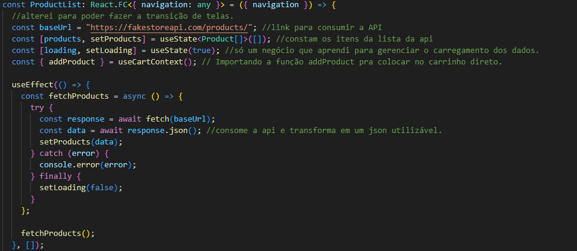
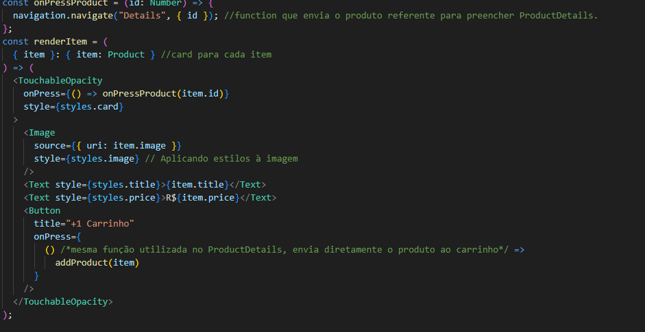
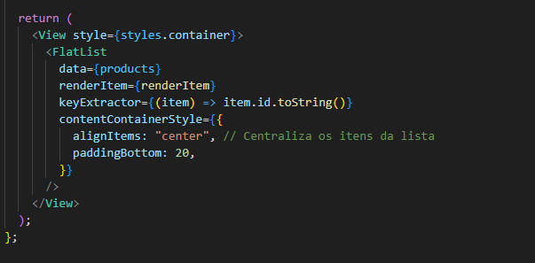
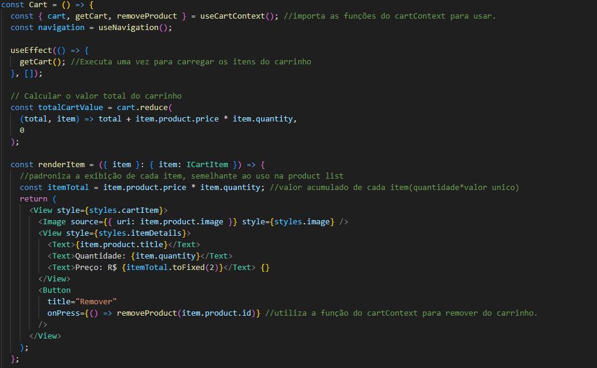
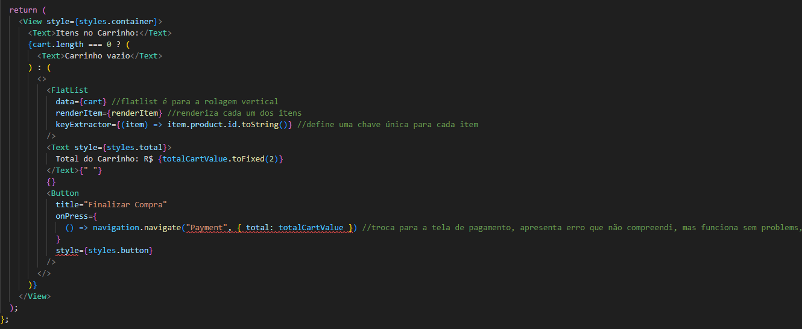

# Shoppis

### features

-**Cart Management**: Users can effortlessly add products to their cart, adjust item quantities, and remove items with confirmation prompts to prevent accidental deletions.

-**Dynamic Total Price Calculation**: The total cost is automatically updated in real time, reflecting the selected items and their quantities.

-**Seamless Payment Input**: Users can enter payment details, including card number, expiration date, and CVV, with automatic formatting for a smoother experience.

-**Persistent Cart Data**: Shopping cart contents are saved using local storage (for web) or AsyncStorage (for mobile), ensuring items remain available across sessions.

-**Order Completion and Confirmation**: After completing a payment, users are shown a success message, their cart is cleared, and they are redirected to the home screen.

-**Order History and Tracking**: Users can access their previous orders and monitor the delivery status of each one.

-**Responsive and User-Friendly Design**: The application is designed to function seamlessly across mobile and web platforms, offering an optimized user experience on all devices.

## interface:

## code examples:

## how to test my application.

-1: clone my repository.
-2: open a terminal and run "npm install expo".
-3: open an integrated terminal in package.json, and run "npx exp", after it, press "w" to select web test
-4: test the application

Solo Deveoper